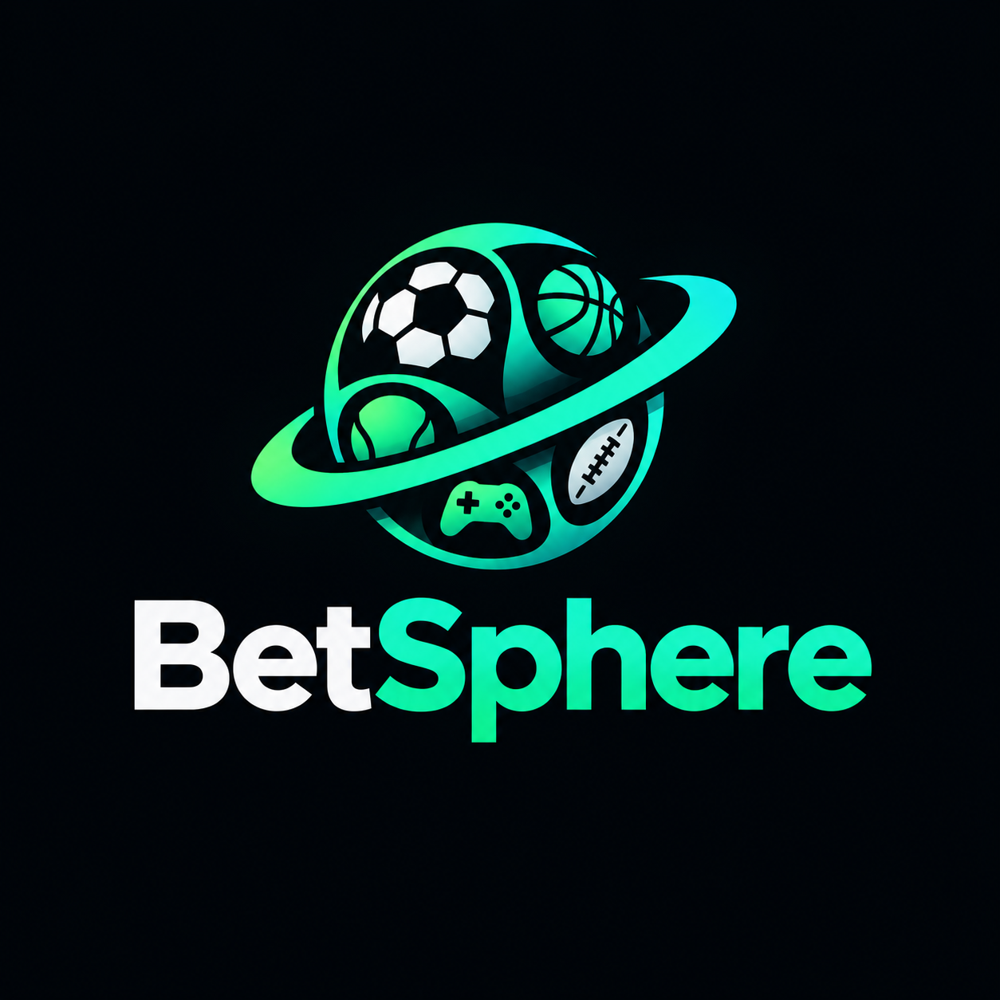
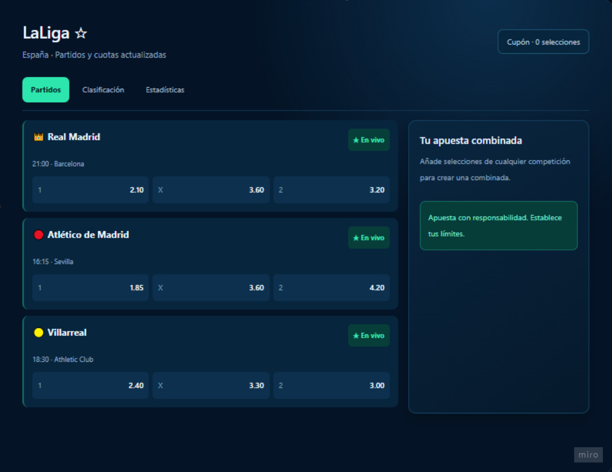
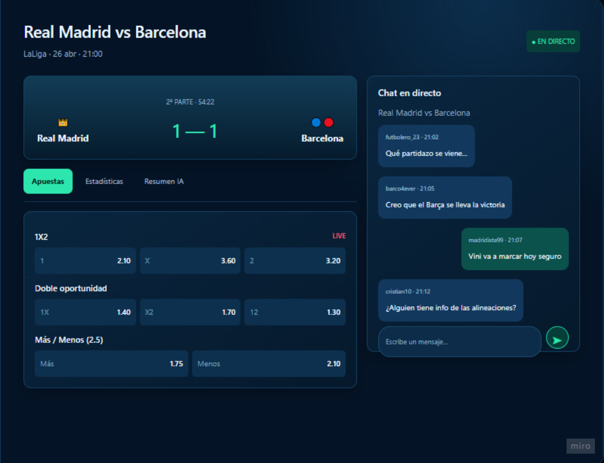
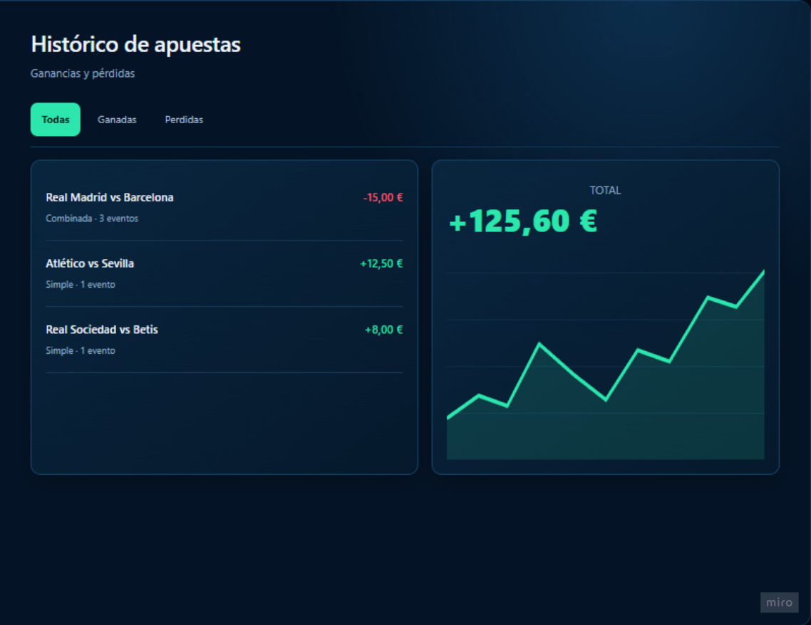
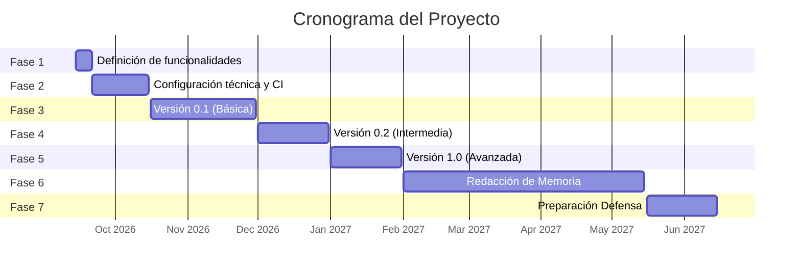
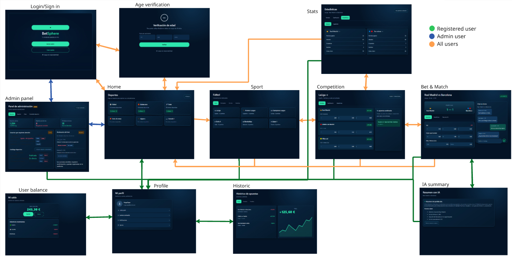
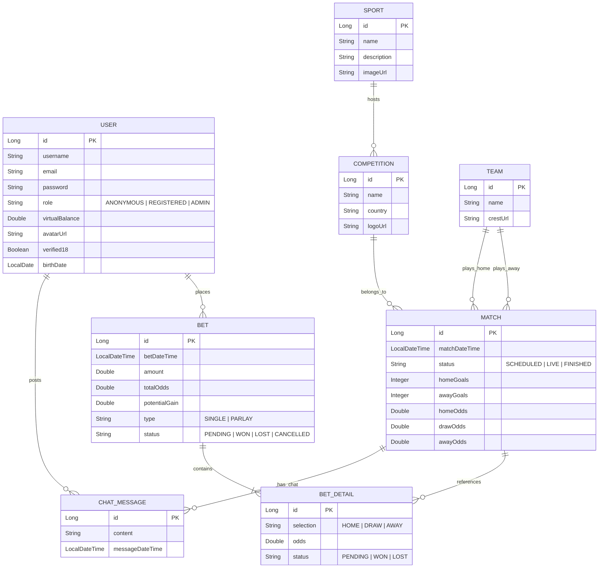

# BetSphere: una aplicación web de apuestas deportivas en tiempo real con apuestas combinadas, salas de chat interactivo por partido y resúmenes de encuentros asistidos por IA.

## Índice

- [1. Resumen de la aplicación](#1-resumen-de-la-aplicación)
- [2. Estado de arte](#2-estado-de-arte)
- [3. Bocetos de pantallas](#3-bocetos-de-pantallas)
- [4. Objetivos](#4-objetivos)
  - [4.1. Objetivos funcionales](#41-objetivos-funcionales)
  - [4.2. Objetivos técnicos](#42-objetivos-técnicos)
- [5. Metodología](#5-metodología)
  - [5.1. Fases](#51-fases)
  - [5.2. Diagrama de Gantt](#52-diagrama-de-gantt)
- [6. Funcionalidad de la web](#6-funcionalidad-de-la-web)
  - [6.1. Funcionalidad básica](#61-funcionalidad-básica)
  - [6.2. Funcionalidad adicional](#62-funcionalidad-adicional)
  - [6.3. Funcionalidad avanzada](#63-funcionalidad-avanzada)
- [7. Requisitos del sistema y características técnicas](#7-requisitos-del-sistema-y-características-técnicas)
  - [7.1. Pantallas y navegación](#71-pantallas-y-navegación)
  - [7.2. Entidades](#72-entidades)
  - [7.3. Permisos de usuarios](#73-permisos-de-usuarios)
  - [7.4. Imágenes](#74-imágenes)
  - [7.5. Gráficos](#75-gráficos)
  - [7.6. Tecnología complementaria](#76-tecnología-complementaria)
  - [7.7. Algoritmo o consulta avanzada](#77-algoritmo-o-consulta-avanzada)
- [8. Seguimiento](#8-seguimiento)
- [9. Autor](#9-autor)
- [10. Uso de IA](#10-uso-de-IA)

## 1. Resumen de la aplicación

BetSphere es una plataforma web orientada al análisis, seguimiento y simulación de apuestas deportivas en tiempo real. Concebida como un entorno digital integrado, la aplicación permite a los usuarios explorar múltiples deportes y competiciones, consultar estadísticas de equipos y seguir la evolución de las cuotas para formalizar pronósticos mediante apuestas simples o combinadas.

A la experiencia de pronósticos se suma un componente social y de análisis, ya que el sistema incorpora salas de chat interactivo asociadas a cada evento en directo para fomentar la participación comunitaria, junto con un módulo de Inteligencia Artificial enfocado en la generación de resúmenes y lecturas analíticas de los encuentros. Todo el ecosistema opera bajo un modelo de gestión de saldo virtual y controles de juego responsable (+18), ofreciendo diferentes niveles de interacción, personalización y moderación adaptados al perfil del usuario (anónimo, registrado y administrador).

## 2. Estado de arte

Para definir los objetivos y la estructura de la aplicación, se ha realizado en primera instancia un estudio de las diferentes aplicaciones pioneras en el sector con funcionalidades similares, para así extraer sus puntos fuertes y además analizar las posibles mejoras a explorar. partir de este análisis se sintetiza la siguiente comparativa del estado del arte:

| Aplicación o Aplicaciones | Puntos fuertes | Mejoras que se propondrán en BetSphere |
| :--- | :--- | :--- |
| [Bet365](https://www.bet365.com), [bwin](https://www.bwin.com) y [DraftKings](https://www.draftkings.com) | Gestión de cuotas dinámicas, apuestas simples/combinadas en tiempo real y catálogo deportivo extenso con dinero real. | Integrar salas de chat interactivo por partido y un entorno de simulación seguro con saldo virtual. |
| [SofaScore](https://www.sofascore.com) y [Flashscore](https://www.flashscore.es) | Seguimiento de resultados en vivo, notificaciones instantáneas y consulta de datos estadísticos de equipos y partidos. | Unificar el seguimiento de datos con un motor propio de simulación de apuestas e incorporar resúmenes post-partido generados por IA. |
| [DAZN](https://www.dazn.com) y [DAZN Bet](https://www.daznbet.es) | Retransmisión de eventos en directo con chat interactivo para los espectadores e integración progresiva de apuestas deportivas. | Proporcionar una plataforma ligera orientada a la simulación sin coste de suscripción ni dinero real, añadiendo asistencia al pronóstico mediante generación de textos con IA. |

Como conclusión del estudio del sector, BetSphere consolida su propuesta de valor sobre tres ejes diferenciadores:

- Interacción social en vivo: Creación de salas de chat simultáneas por partido mediante comunicación bidireccional en tiempo real, transformando el consumo pasivo en un entorno participativo.

- Simulación y juego responsable: Utilización de saldo virtual respaldado por pasarelas de pago en modo prueba, eliminando la barrera económica y el riesgo monetario real bajo una política de verificación de edad.

- Sintesis analítica asistida por IA: Uso de GenAI para interpretar volúmenes complejos de datos estadísticos y ofrecer resúmenes comprensibles en lenguaje natural.

## 3. Bocetos de pantallas

> **Nota importante:** En la fase actual del proyecto únicamente se han definido los objetivos funcionales y técnicos, así como la arquitectura y el modelo de datos. **La implementación del software no ha comenzado todavía.** Los bocetos presentados a continuación constituyen una representación conceptual preliminar para guiar el desarrollo de la interfaz.

#### 1. Vista de competición (Competition)

  
*Figura 3.1: Boceto de la vista de competición (LaLiga) con partidos en vivo, cuotas 1X2 y cupón de apuestas combinadas.*

* **Descripción:** Pantalla dedicada al detalle de una competición específica (ej. LaLiga). Permite explorar los partidos programados o en directo, consultar cuotas principales de resultado (1X2) y gestionar la elaboración de cupones de apuestas simples o combinadas.
* **Componentes clave:** Encabezado de torneo con opción a favoritos, pestañas de navegación (Partidos, Clasificación, Estadísticas), tarjetas de partidos con indicador "En vivo", cupón lateral interactivo y recordatorio de juego responsable.

#### 2. Evento, Apuestas e Inteligencia Artificial (Bet & Match + IA Summary)

  
*Figura 3.2: Boceto del detalle de partido con marcadores, cuotas dinámicas, chat interactivo y resumen analítico generado por IA.*

* **Descripción:** Núcleo interactivo de la aplicación. Muestra los detalles de un partido específico junto con las cuotas dinámicas, chat interactivo y el módulo de análisis generado por Inteligencia Artificial.
* **Componentes clave:** Marcador en directo, cuotas de apuestas, chat interactivo de la comunidad y recuadro de resumen/predicción que generará la IA.

#### 3. Histórico de Apuestas y Saldo Virtual (Historic + User Balance)

  
*Figura 3.3: Boceto del panel de usuario con evolución gráfica de pérdidas/ganancias (PnL), historial de apuestas y saldo virtual.*

* **Descripción:** Panel de control privado del usuario registrado para hacer seguimiento de su actividad financiera simulada y gestionar su cuenta.
* **Componentes clave:** Gráfico de rendimiento (*PnL* / Pérdidas y Ganancias), desglose de apuestas ganadas/perdidas y módulo para simular recargas de saldo virtual.

## 4. Objetivos

### 4.1 Objetivos funcionales

BetSphere tiene como objetivo funcional ofrecer una plataforma web integral para la simulación de apuestas deportivas y el seguimiento de eventos en tiempo real dentro de un entorno seguro y sin riesgo monetario. La aplicación busca transformar la experiencia tradicional del usuario integrando espacios comunitarios de discusión simultánea por partido, análisis explicativos generados por Inteligencia Artificial y una gestión rigurosa de permisos basada en roles, garantizando en todo momento la adherencia a políticas de juego responsable (+18).

- Gestión de usuarios y control de acceso: Autenticación de usuarios, registro con verificación obligatoria de mayoría de edad y segregación estricta de permisos entre perfiles anónimos, registrados y administradores.

- Exploración del catálogo deportivo: Navegación por disciplinas deportivas, ligas y encuentros, permitiendo la visualización detallada de eventos y cuotas dinámicas.

- Motor de simulación de pronósticos: Permitir la configuración y formalización de boletos de apuestas simples y combinadas utilizando exclusivamente un saldo virtual ficticio.

- Interacción social en tiempo real: Salas de chat comunitarias asociadas a cada partido en directo para promover el debate dinámico entre los usuarios conectados.

- Asistencia analítica mediante GenAI: Generación automatizada de resúmenes e interpretaciones estadísticas redactadas en lenguaje natural para orientar la toma de decisiones.

- Gestión de saldo virtual y transacciones: Funcionalidad para simular el depósito y la retirada de fondos ficticios mediante una pasarela de pago en entorno de pruebas.

- Panel de administración y moderación: Herramientas centralizadas para el alta/edición del catálogo deportivo, la resolución manual u operativa de eventos y la moderación de mensajes o bloqueo de usuarios.

### 4.2 Objetivos técnicos

El proyecto busca diseñar e implementar una arquitectura de software distribuida, robusta y desacoplada. La solución técnica integra un backend desarrollado en Spring Boot, una interfaz SPA (Single Page Application) desarrollada en React y una base de datos relacional MySQL, combinando protocolos de comunicación en tiempo real, consumo de APIs externas de datos y servicios de Inteligencia Artificial Generativa.

- Desarrollo de API RESTful con Spring Boot: Construcción de un servicio backend modular y escalable, aplicando patrones de diseño estándar, persistencia relacional con Spring Data JPA e inversión de control.

- Construcción de interfaz SPA con React: Implementación de un frontend moderno, dinámico y responsivo basado en componentes reutilizables y gestión eficiente del estado global.

- Comunicación bidireccional con WebSockets: Integración del protocolo WebSocket (STOMP/SockJS) para el intercambio instantáneo de mensajes en los chats en directo y la sincronización reactiva de marcadores.

- Mecanismos de seguridad y autorización: Aplicación de Spring Security para el cifrado de contraseñas, gestión de sesiones y comprobación estricta de propiedad de datos a nivel de recurso.

- Ingesta e integración de APIs REST externas: Conexión asíncrona con servicios de terceros para la obtención y actualización automatizada de datos deportivos y cuotas iniciales.

- Procesamiento algorítmico y transaccionalidad: Algoritmos dedicados al cálculo de cuotas acumuladas y ejecución de tareas atómicas en segundo plano para la resolución masiva de boletos sin problemas de concurrencia.

- Integración de servicios de Stripe y LLM: Consumo e integración del SDK de Stripe (modo test) para la simulación de pagos y conexión vía cliente HTTP con modelos de lenguaje para la síntesis de textos analíticos.

## 5. Metodología
### 5.1. Fases

El desarrollo del proyecto se realiza siguiendo una metodología iterativa e incremental estructurada en las siguientes etapas:  
- Fase 1: Definición de funcionalidades: Se indican las secciones concretas en las que se describe la funcionalidad general y detallada de la aplicación.  
- Fase 2: Configuración técnica: Configuración de las tecnologías y herramientas de desarrollo junto con controles de calidad periódicos.  
- Fases 3, 4 y 5: Desarrollo iterativo e incremental: Implementación de la aplicación en varios ciclos, publicando una versión (release) al término de cada fase.  
- Fase 6: Escritura de la memoria: Elaboración de la memoria escrita del TFG.  
- Fase 7: Preparación de la presentación: Preparación del material y contenido para el acto de defensa. 

Las fechas de inicio fin son provisionales y se acordarán con el tutor, con el objetivo de que en enero haya un cierre funcional de BetSphere para continuar con el segundo TFG.

| Fase | Inicio propuesto | Fin propuesto |
| :--- | :---: | :---: |
| **Fase 1** | 14/09/2026 | 21/09/2026 |
| **Fase 2** | 21/09/2026 | 15/10/2026 |
| **Fase 3** | 16/10/2026 | 30/11/2026 |
| **Fase 4** | 01/12/2026 | 31/12/2026 |
| **Fase 5** | 01/01/2027 | 31/01/2027 |
| **Fase 6** | 01/02/2027 | 15/05/2027 |
| **Fase 7** | 16/05/2027 | 15/06/2027 |

### 5.2 Diagrama de Gantt

## 6. Funcionalidad de la web

### 6.1. Funcionalidad básica

| Rol | Funcionalidades |
| :--- | :--- |
| **Anónimo** | • Navegación básica por deportes, competiciones y partidos. • Consulta de cuotas de partidos de forma estática. • Simulación de apuesta sin permitir la ejecución. |
| **Usuario registrado** | • Registro de cuenta, verificación de edad (+18) e inicio de sesión. • Gestión de perfil de usuario. • Consulta de deportes, competiciones y partidos. • Realización de apuestas simples sobre un partido individual. |
| **Usuario administrador** | • Acceso al panel de administración. • Listado general de usuarios registrados en el sistema. • Creación y edición básica de deportes, competiciones y partidos. |

### 6.2. Funcionalidad adicional

| Rol | Funcionalidades |
| :--- | :--- |
| **Usuario registrado** | • Visualización y participación en el chat en directo de los partidos. • Realización de apuestas combinadas sobre múltiples partidos de distintas competiciones, deportes o encuentros. • Insertar y retirar saldo virtual mediante pasarelas de pago. • Consultar el histórico de pérdidas y ganancias. |
| **Usuario administrador** | • Moderación de chat en directo (eliminación de mensajes en tiempo real). • Control de usuarios desde el panel de administración (bloqueo/desbloqueo y baneo). • Gestión operativa de partidos: inicio/cierre de eventos y actualización de marcadores. |

### 6.3. Funcionalidad avanzada

| Rol | Funcionalidades |
| :--- | :--- |
| **Usuario Anónimo** | • Consulta de métricas deportivas basadas en la ingesta de datos desde APIs REST externas. |
| **Usuario Registrado** | • Generación de resúmenes analíticos y previas de partidos mediante Inteligencia Artificial Generativa (GenAI). • Módulo exploratorio de estadísticas avanzadas de equipos para asistencia en pronósticos (integración con servicios externos de datos). • Procesamiento seguro de saldo mediante integración con la API de Stripe. |
| **Usuario Administrador** | • Acceso completo a todas las funcionalidades avanzadas de usuario registrado (IA, estadísticas avanzadas y operaciones financieras completas). • Gestión avanzada del catálogo deportivo: borrado en cascada de competiciones/deportes sin actividad, ajustes globales de cuotas y analíticas del panel de administración. |

## 7. Requisitos del sistema y características técnicas

### 7.1. Pantallas y navegación

*Figura 7.1 Mapa de navegación de BetSphere con los flujos y accesos diferenciados por rol de usuario (Anónimo, Registrado y Administrador).*

| Pantalla | Usuario | Descripción | Páginas accesibles |
| :--- | :--- | :--- | :--- |
| **Login / Sign in** | Anónimo, Registrado, Administrador | Formulario para la autenticación de usuarios e inicio de sesión o registro en la plataforma. | Home, Age verification, Admin panel. |
| **Age verification** | Anónimo, Registrado, Administrador | Comprobación obligatoria de mayoría de edad (+18) para cumplir con las políticas de juego responsable. | Home, Login / Sign in. |
| **Home** | Anónimo, Registrado, Administrador | Vista principal con el catálogo general de deportes, eventos destacados y accesos globales. | Login / Sign in, Age verification, Sport, Profile, Historic, Admin panel. |
| **Sport** | Anónimo, Registrado, Administrador | Muestra las ligas y competiciones asociadas a una disciplina deportiva específica. | Home, Profile, Competition, Stats, Login / Sign in. |
| **Competition** | Anónimo, Registrado, Administrador | Muestra el listado de partidos y cuotas 1X2 de una liga concreta, permitiendo armar boletos de apuestas. | Home, Profile, Sport, Bet & Match, Stats, Historic, Login / Sign in. |
| **Bet & Match** | Anónimo, Registrado, Administrador | Ficha detallada del evento con marcadores en vivo, cuotas dinámicas y canal de chat en tiempo real. | Home, Profile, Competition, IA summary, Login / Sign in. |
| **IA summary** | Anónimo, Registrado, Administrador | Módulo con análisis predictivos y resúmenes analíticos generados mediante Inteligencia Artificial. | Home, Profile, Bet & Match, Login / Sign in. |
| **Stats** | Anónimo, Registrado, Administrador | Módulo visual de estadísticas avanzadas y métricas de rendimiento histórico de equipos. | Home, Profile, Sport, Competition, Login / Sign in. |
| **Profile** | Registrado, Administrador | Gestión de la cuenta del usuario, datos personales y preferencias de la plataforma. | Home, User balance, Historic. |
| **User balance** | Registrado, Administrador | Interfaz para la simulación de recargas y retiradas de saldo virtual mediante pasarela de pago. | Home, Profile, Historic. |
| **Historic** | Registrado, Administrador | Muestra el historial completo de boletos de apuestas y la gráfica de rendimiento financiero (PnL). | Home, Profile, User balance, Competition. |
| **Admin panel** | Administrador | Panel centralizado para la gestión de usuarios, moderación de mensajes y administración del catálogo deportivo. | Home, Profile, Login / Sign in. |

### 7.2. Entidades

El modelo de datos consta de 8 entidades principales que sustentan la lógica de negocio central: gestión de usuarios, catálogo de deportes, apuestas simples y combinadas, chat de partidos en tiempo real y transacciones.

Descripciones de relaciones clave

- Apuestas combinadas (BET y BET_DETAIL): Una apuesta (BET) actúa como un boleto principal que contiene una o más selecciones o tramos (BET_DETAIL). Las apuestas simples constan exactamente de una selección, mientras que las apuestas combinadas incluyen dos o más selecciones vinculadas a partidos diferentes.

- Equipos y partidos: Cada partido (MATCH) hace referencia a dos instancias de equipo (TEAM): local y visitante.

- Chat del evento: Un partido (MATCH) alberga múltiples instancias de mensajes de chat (CHAT_MESSAGE) publicadas por usuarios registrados (USER).

### 7.3. Permisos de usuarios

La arquitectura de seguridad integra un esquema de control de acceso basado en roles, complementado con políticas de seguridad a nivel de datos basadas en propiedad. Se describen los siguientes tipos de usuario: 

- Usuario Anónimo: Acceso para la exploración de deportes, eventos, cuotas estáticas y estadísticas avanzadas de equipos, junto con la simulación no ejecutable de apuestas.

- Usuario Registrado: Permisos de ejecución sobre recursos propios. Se implementan controles estrictos de propiedad, garantizando que los usuarios únicamente puedan consultar, gestionar o modificar su propio historial de boletos de apuestas, saldo virtual y datos de perfil.

- Usuario Administrador: Control global del sistema mediante credenciales cifradas en el servidor. Dispone de privilegios para la gestión del catálogo deportivo, moderación de mensajes en tiempo real y administración del estado de cuentas de usuario (bloqueo/baneo).

### 7.4. Imágenes

La aplicación incorpora un sistema de almacenamiento y gestión de archivos multimedia que permite la carga diferida de imágenes desde la interfaz web según el rol del usuario:

- Usuario Registrado: Capacidad de subida de archivos de imagen desde el panel de ajustes para la personalización del avatar y foto de perfil.

- Usuario Administrador: Gestión de recursos gráficos para la identidad visual del catálogo deportivo, permitiendo adjuntar logotipos e imágenes al dar de alta o editar nuevos deportes y competiciones en el sistema.

### 7.5. Gráficos

Para facilitar la interpretación de grandes volúmenes de datos y el seguimiento financiero, la interfaz integra componentes visuales interactivos:

- Evolución del Saldo y Rendimiento: Gráficos de líneas que representan el histórico temporal de pérdidas y ganancias, mostrando la variación del saldo virtual del usuario tras la resolución de cada boleto de apuestas.

### 7.6. Tecnología complementaria

El sistema se apoya en servicios distribuidos y bibliotecas especializadas para extender su funcionalidad base:

- Comunicación en Tiempo Real (WebSockets): Canal bidireccional que permite la transmisión instantánea de mensajes en las salas de chat por partido y la actualización reactiva de marcadores en vivo.

- Ingesta de APIs REST Externas: Conexión automatizada con servicios externos de datos deportivos para la sincronización periódica de eventos, competiciones y cuotas iniciales.

- Pasarela de Pago Virtual: Integración con la API de Stripe (en modo prueba) para simular de forma realista los flujos de depósito y retirada de saldo ficticio dentro del ecosistema.

### 7.7. Algoritmo o consulta avanzada

Se implementan módulos algorítmicos específicos para procesar la lógica de negocio central del sistema:

- Motor de Apuestas Combinadas: Algoritmo de cálculo dinámico para determinar la cuota acumulada final y las ganancias potenciales en función de las selecciones múltiples hechas por el usuario.

- Resolución Transaccional de Boletos: Procesamiento atómico en segundo plano que evalúa el resultado de los partidos finalizados, actualizando automáticamente el estado de los boletos (ganados/perdidos) y ajustando el saldo virtual de los usuarios sin inconsistencias de concurrencia.

- Motor Analítico con GenAI: Módulo basado en Inteligencia Artificial Generativa que sintetiza métricas deportivas para generar resúmenes explicativos y lecturas analíticas en lenguaje natural.

## 8. Seguimiento

- **GitHub Projects:** Gestión ágil de tareas, planificación de sprints e hitos del proyecto mediante el tablero Kanban integrado en el repositorio.
- **Registro de cambios:** Historial detallado de versiones y modificaciones notables documentado en el archivo [`CHANGELOG.md`](./CHANGELOG.md).

## 9. Autor

Esta aplicación web se ha desarrollado como **Trabajo de Fin de Grado (TFG)** de la titulación **Doble Grado en Ingeniería Informática e Ingeniería del Software (GII + GIS)** en la Escuela Técnica Superior de Ingeniería Informática (ETSII) de la **Universidad Rey Juan Carlos (URJC)**.

- **Alumno:** Hugo Capa Mora.
- **Tutor:** Óscar Soto Sánchez.

## 10. Uso de IA

El uso de herramientas basadas en Inteligencia Artificial Generativa se ha articulado bajo principios de transparencia académica y eficiencia técnica. El detalle completo de las interacciones, promps y trazabilidad se encuentra recogido en el archivo [`AI_USAGE.md`](./AI_USAGE.md).

- **Google Gemini:** Utilizado como asistente interactivo para la investigación temática del sector, delimitación del alcance y funcionalidades, definición del estado del arte, estructuración de la documentación técnica y refinamiento formal del texto de la memoria.
- **OpenAI Codex:** Empleado como herramienta de apoyo en el prototipado inicial de las pantallas, maquetación de la interfaz de usuario y estructura base de navegación.