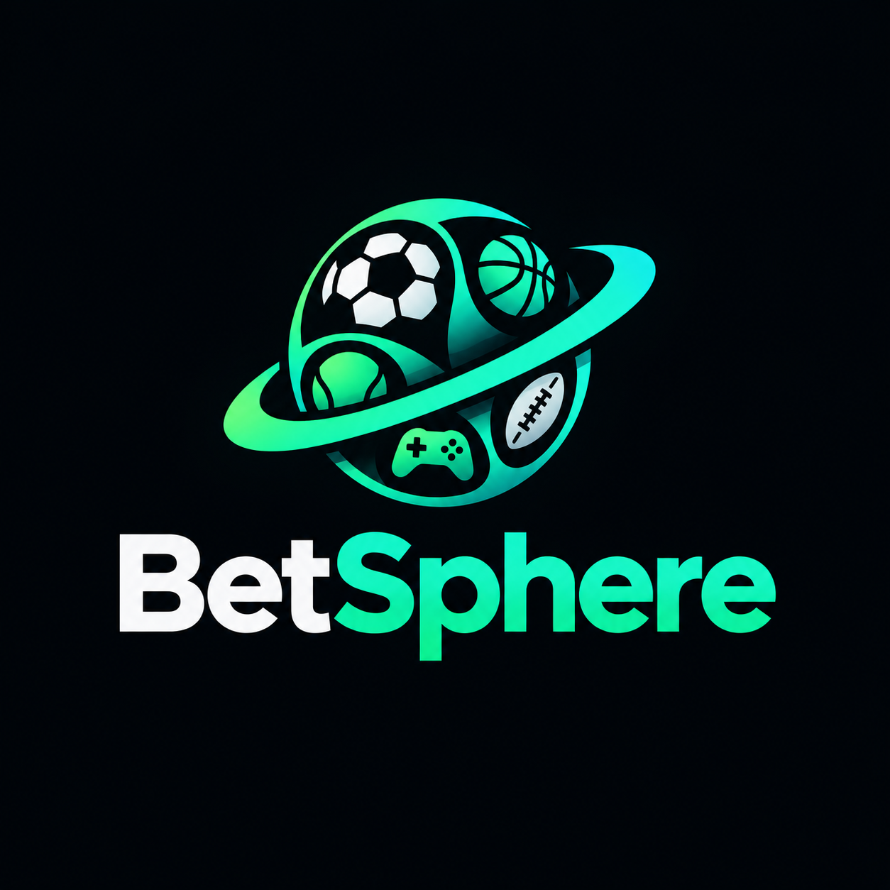
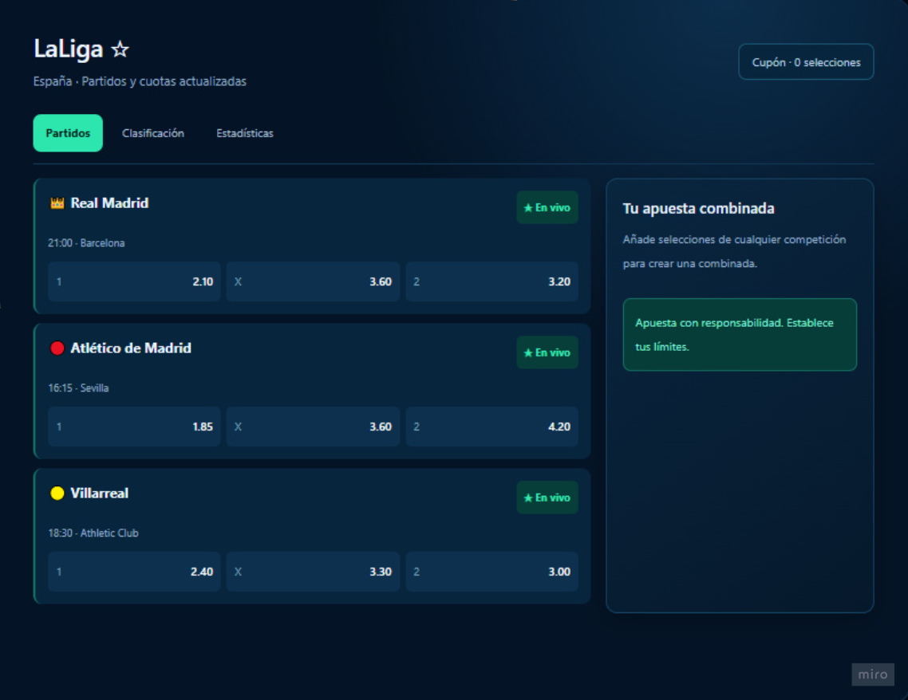
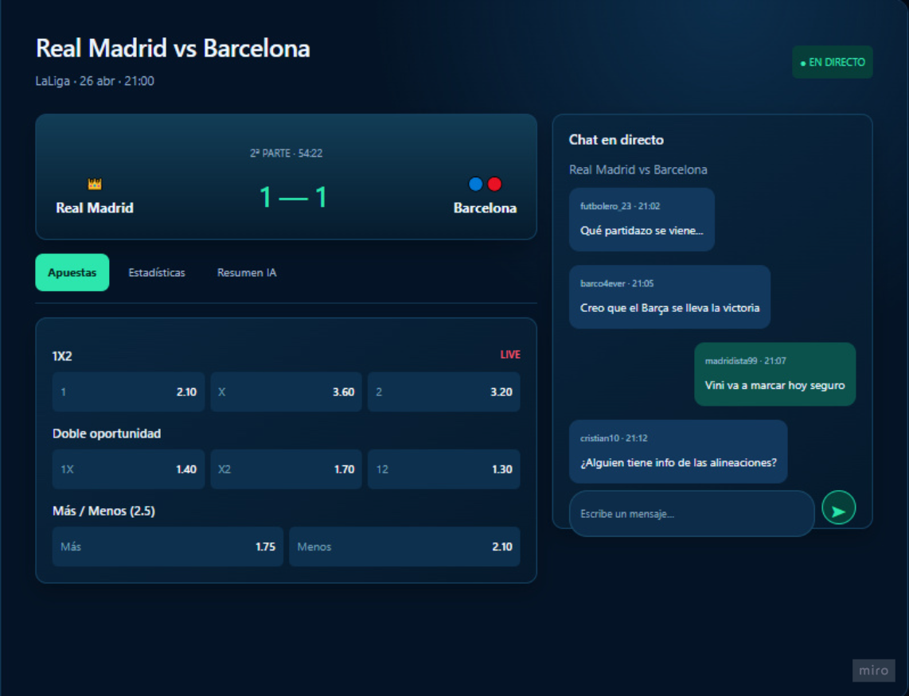
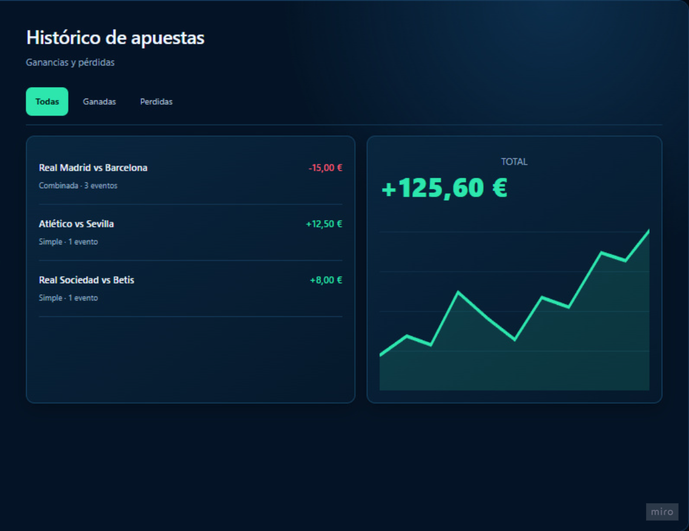

# BetSphere: una aplicación web de apuestas deportivas en tiempo real con apuestas combinadas, salas de chat interactivo por partido y resúmenes de encuentros asistidos por IA.

BetSphere es una plataforma web orientada al análisis, seguimiento y simulación de apuestas deportivas en tiempo real. Concebida como un entorno digital integrado, la aplicación permite a los usuarios explorar múltiples deportes y competiciones, consultar estadísticas de equipos y seguir la evolución de las cuotas para formalizar pronósticos mediante apuestas simples o combinadas.

A la experiencia de pronósticos se suma un componente social y de análisis, ya que el sistema incorpora salas de chat interactivo asociadas a cada evento en directo para fomentar la participación comunitaria, junto con un módulo de Inteligencia Artificial enfocado en la generación de resúmenes y lecturas analíticas de los encuentros. Todo el ecosistema opera bajo un modelo de gestión de saldo virtual y controles de juego responsable (+18), ofreciendo diferentes niveles de interacción, personalización y moderación adaptados al perfil del usuario (anónimo, registrado y administrador).

> **Nota importante:** En la fase actual del proyecto únicamente se han definido los objetivos funcionales y técnicos, así como la arquitectura y el modelo de datos. **La implementación del software no ha comenzado todavía.** Los bocetos presentados a continuación constituyen una representación conceptual preliminar para guiar el desarrollo de la interfaz.

## Bocetos de pantallas

#### 1. Vista de competición (Competition)

  
*Boceto de la vista de competición (LaLiga) con partidos en vivo, cuotas 1X2 y cupón de apuestas combinadas.*

* **Descripción:** Pantalla dedicada al detalle de una competición específica (ej. LaLiga). Permite explorar los partidos programados o en directo, consultar cuotas principales de resultado (1X2) y gestionar la elaboración de cupones de apuestas simples o combinadas.
* **Componentes clave:** Encabezado de torneo con opción a favoritos, pestañas de navegación (Partidos, Clasificación, Estadísticas), tarjetas de partidos con indicador "En vivo", cupón lateral interactivo y recordatorio de juego responsable.

#### 2. Evento, Apuestas e Inteligencia Artificial (Bet & Match + IA Summary)

  
*Boceto del detalle de partido con marcadores, cuotas dinámicas, chat interactivo y resumen analítico generado por IA.*

* **Descripción:** Núcleo interactivo de la aplicación. Muestra los detalles de un partido específico junto con las cuotas dinámicas, chat interactivo y el módulo de análisis generado por Inteligencia Artificial.
* **Componentes clave:** Marcador en directo, cuotas de apuestas, chat interactivo de la comunidad y recuadro de resumen/predicción que generará la IA.

#### 3. Histórico de Apuestas y Saldo Virtual (Historic + User Balance)

  
*Boceto del panel de usuario con evolución gráfica de pérdidas/ganancias (PnL), historial de apuestas y saldo virtual.*

* **Descripción:** Panel de control privado del usuario registrado para hacer seguimiento de su actividad financiera simulada y gestionar su cuenta.
* **Componentes clave:** Gráfico de rendimiento (*PnL* / Pérdidas y Ganancias), desglose de apuestas ganadas/perdidas y módulo para simular recargas de saldo virtual.

## Documentación

- [Estado de arte](./docs/state-of-art.md)
- [Objetivos](./docs/objectives.md)
- [Metodología](./docs/methodology.md)
- [Funcionalidad de la web](./docs/detailed-functionalities.md)
- [Requisitos del sistema y características técnicas](./docs/analysis.md)
- [Seguimiento](./docs/follow-up.md)
- [Autor](./docs/authors.md)
- [Guía de desarrollo](./docs/development-guide.md)
- [Uso de IA](#uso-de-ia)
- [Changelog](./CHANGELOG.md)

## Uso de IA

El uso de herramientas basadas en Inteligencia Artificial Generativa se ha articulado bajo principios de transparencia académica y eficiencia técnica. El detalle completo de las interacciones, promps y trazabilidad se encuentra recogido en el archivo [`AI_USAGE.md`](./docs/AI_USAGE.md).

- **Google Gemini:** Utilizado como asistente interactivo para la investigación temática del sector, delimitación del alcance y funcionalidades, definición del estado del arte, estructuración de la documentación técnica y refinamiento formal del texto de la memoria.
- **OpenAI Codex:** Empleado como herramienta de apoyo en el prototipado inicial de las pantallas, maquetación de la interfaz de usuario y estructura base de navegación.