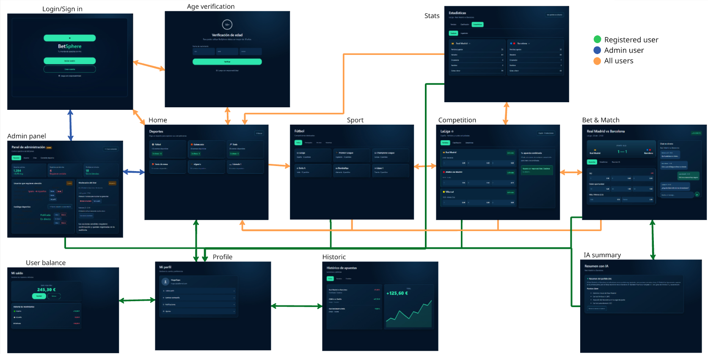
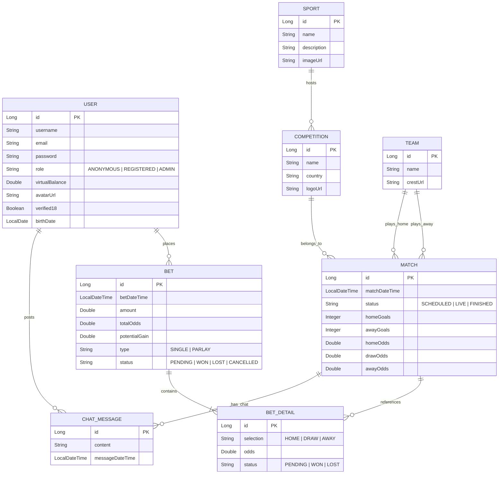

# Requisitos del sistema y características técnicas

## Pantallas y navegación

*Mapa de navegación de BetSphere con los flujos y accesos diferenciados por rol de usuario (Anónimo, Registrado y Administrador).*

| Pantalla | Usuario | Descripción | Páginas accesibles |
| :--- | :--- | :--- | :--- |
| **Login / Sign in** | Anónimo, Registrado, Administrador | Formulario para la autenticación de usuarios e inicio de sesión o registro en la plataforma. | Home, Age verification, Admin panel. |
| **Age verification** | Anónimo, Registrado, Administrador | Comprobación obligatoria de mayoría de edad (+18) para cumplir con las políticas de juego responsable. | Home, Login / Sign in. |
| **Home** | Anónimo, Registrado, Administrador | Vista principal con el catálogo general de deportes, eventos destacados y accesos globales. | Login / Sign in, Age verification, Sport, Profile, Historic, Admin panel. |
| **Sport** | Anónimo, Registrado, Administrador | Muestra las ligas y competiciones asociadas a una disciplina deportiva específica. | Home, Profile, Competition, Stats, Login / Sign in. |
| **Competition** | Anónimo, Registrado, Administrador | Muestra el listado de partidos y cuotas 1X2 de una liga concreta, permitiendo armar boletos de apuestas. | Home, Profile, Sport, Bet & Match, Stats, Historic, Login / Sign in. |
| **Bet & Match** | Anónimo, Registrado, Administrador | Ficha detallada del evento con marcadores en vivo, cuotas dinámicas y canal de chat en tiempo real. | Home, Profile, Competition, IA summary, Login / Sign in. |
| **IA summary** | Anónimo, Registrado, Administrador | Módulo con análisis predictivos y resúmenes analíticos generados mediante Inteligencia Artificial. | Home, Profile, Bet & Match, Login / Sign in. |
| **Stats** | Anónimo, Registrado, Administrador | Módulo visual de estadísticas avanzadas y métricas de rendimiento histórico de equipos. | Home, Profile, Sport, Competition, Login / Sign in. |
| **Profile** | Registrado, Administrador | Gestión de la cuenta del usuario, datos personales y preferencias de la plataforma. | Home, User balance, Historic. |
| **User balance** | Registrado, Administrador | Interfaz para la simulación de recargas y retiradas de saldo virtual mediante pasarela de pago. | Home, Profile, Historic. |
| **Historic** | Registrado, Administrador | Muestra el historial completo de boletos de apuestas y la gráfica de rendimiento financiero (PnL). | Home, Profile, User balance, Competition. |
| **Admin panel** | Administrador | Panel centralizado para la gestión de usuarios, moderación de mensajes y administración del catálogo deportivo. | Home, Profile, Login / Sign in. |

## Entidades

El modelo de datos consta de 8 entidades principales que sustentan la lógica de negocio central: gestión de usuarios, catálogo de deportes, apuestas simples y combinadas, chat de partidos en tiempo real y transacciones.

Descripciones de relaciones clave

- Apuestas combinadas (BET y BET_DETAIL): Una apuesta (BET) actúa como un boleto principal que contiene una o más selecciones o tramos (BET_DETAIL). Las apuestas simples constan exactamente de una selección, mientras que las apuestas combinadas incluyen dos o más selecciones vinculadas a partidos diferentes.

- Equipos y partidos: Cada partido (MATCH) hace referencia a dos instancias de equipo (TEAM): local y visitante.

- Chat del evento: Un partido (MATCH) alberga múltiples instancias de mensajes de chat (CHAT_MESSAGE) publicadas por usuarios registrados (USER).

## Permisos de usuarios

La arquitectura de seguridad integra un esquema de control de acceso basado en roles, complementado con políticas de seguridad a nivel de datos basadas en propiedad. Se describen los siguientes tipos de usuario: 

- Usuario Anónimo: Acceso para la exploración de deportes, eventos, cuotas estáticas y estadísticas avanzadas de equipos, junto con la simulación no ejecutable de apuestas.

- Usuario Registrado: Permisos de ejecución sobre recursos propios. Se implementan controles estrictos de propiedad, garantizando que los usuarios únicamente puedan consultar, gestionar o modificar su propio historial de boletos de apuestas, saldo virtual y datos de perfil.

- Usuario Administrador: Control global del sistema mediante credenciales cifradas en el servidor. Dispone de privilegios para la gestión del catálogo deportivo, moderación de mensajes en tiempo real y administración del estado de cuentas de usuario (bloqueo/baneo).

## Imágenes

La aplicación incorpora un sistema de almacenamiento y gestión de archivos multimedia que permite la carga diferida de imágenes desde la interfaz web según el rol del usuario:

- Usuario Registrado: Capacidad de subida de archivos de imagen desde el panel de ajustes para la personalización del avatar y foto de perfil.

- Usuario Administrador: Gestión de recursos gráficos para la identidad visual del catálogo deportivo, permitiendo adjuntar logotipos e imágenes al dar de alta o editar nuevos deportes y competiciones en el sistema.

## Gráficos

Para facilitar la interpretación de grandes volúmenes de datos y el seguimiento financiero, la interfaz integra componentes visuales interactivos:

- Evolución del Saldo y Rendimiento: Gráficos de líneas que representan el histórico temporal de pérdidas y ganancias, mostrando la variación del saldo virtual del usuario tras la resolución de cada boleto de apuestas.

## Tecnología complementaria

El sistema se apoya en servicios distribuidos y bibliotecas especializadas para extender su funcionalidad base:

- Comunicación en Tiempo Real (WebSockets): Canal bidireccional que permite la transmisión instantánea de mensajes en las salas de chat por partido y la actualización reactiva de marcadores en vivo.

- Ingesta de APIs REST Externas: Conexión automatizada con servicios externos de datos deportivos para la sincronización periódica de eventos, competiciones y cuotas iniciales.

- Pasarela de Pago Virtual: Integración con la API de Stripe (en modo prueba) para simular de forma realista los flujos de depósito y retirada de saldo ficticio dentro del ecosistema.

## Algoritmo o consulta avanzada

Se implementan módulos algorítmicos específicos para procesar la lógica de negocio central del sistema:

- Motor de Apuestas Combinadas: Algoritmo de cálculo dinámico para determinar la cuota acumulada final y las ganancias potenciales en función de las selecciones múltiples hechas por el usuario.

- Resolución Transaccional de Boletos: Procesamiento atómico en segundo plano que evalúa el resultado de los partidos finalizados, actualizando automáticamente el estado de los boletos (ganados/perdidos) y ajustando el saldo virtual de los usuarios sin inconsistencias de concurrencia.

- Motor Analítico con GenAI: Módulo basado en Inteligencia Artificial Generativa que sintetiza métricas deportivas para generar resúmenes explicativos y lecturas analíticas en lenguaje natural.