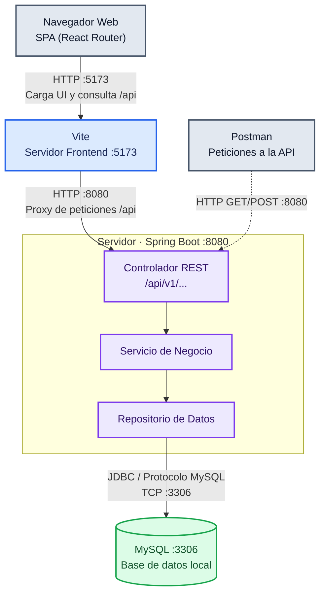
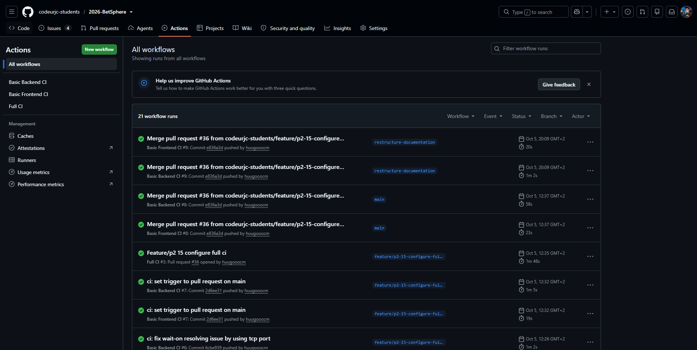

# Guía de desarrollo

Esta guía describe el estado técnico de BetSphere durante la Fase 2. La aplicación completa definida en la documentación funcional todavía no es funcional: la versión actual permite ejecutar la infraestructura base y consultar un conjunto mínimo de datos de ejemplo de la entidad principal, persistidos en la base de datos. Los comandos se ejecutan desde la raíz del repositorio salvo que se indique lo contrario.

## Índice

- [Introducción](#introducción)
- [Tecnologías](#tecnologías)
- [Herramientas](#herramientas)
- [Arquitectura](#arquitectura)
- [Control de calidad](#control-de-calidad)
- [Proceso de desarrollo](#proceso-de-desarrollo)
- [Ejecución y edición del código](#ejecución-y-edición-del-código)

---

## Introducción

BetSphere se desarrolla como una aplicación web **SPA (Single Page Application)**. En este modelo, el navegador web carga el cliente de React una única vez y actualiza dinámicamente las vistas mediante el enrutador sin necesidad de solicitar una página HTML nueva al servidor en cada navegación. El cliente solicita y envía datos a través de peticiones HTTP a una API REST desarrollada en Spring Boot. El servidor gestiona la lógica de negocio y persiste la información de dominio en una base de datos MySQL.

| Aspecto | Estado de Fase 2 |
| --- | --- |
| **Tipo** | Aplicación Web SPA (cliente) y API REST (servidor). |
| **Tecnologías** | React, TypeScript, React Router y Vite; Java y Spring Boot; MySQL. |
| **Herramientas** | Entornos IDE (Visual Studio Code / IntelliJ), Git, GitHub, Node.js, Docker, OpenAPI y Postman. |
| **Control de calidad** | JUnit, Mockito, Testcontainers, Selenium, Vitest y flujos automáticos en GitHub Actions. |
| **Despliegue** | Entorno local de desarrollo con MySQL y cliente/servidor ejecutándose como procesos locales independientes. |
| **Proceso** | Iterativo e incremental basado en Programación Extrema (XP) y Kanban, ramas de funcionalidad cortas y controles obligatorios de CI/CD para la integración. |

## Tecnologías

*   **[Java](https://dev.java/) y [Spring Boot](https://spring.io/projects/spring-boot/):** Conforman el núcleo del backend, implementando la API REST, la seguridad, la capa de servicios de dominio y el acceso a datos mediante el patrón Repositorio.
*   **[MySQL](https://www.mysql.com/):** Sistema de gestión de bases de datos relacional empleado para la persistencia del modelo de datos de la plataforma.
*   **[React](https://react.dev/), [TypeScript](https://www.typescriptlang.org/) y [React Router](https://reactrouter.com/):** Forman el cliente SPA. React Router gestiona la navegación interna de la aplicación, mientras que TypeScript garantiza el tipado estricto para evitar errores en tiempo de compilación.
*   **[Vite](https://vitejs.dev/):** Herramienta de construcción (build tool) y servidor de desarrollo local para el frontend, que proporciona un arranque ultra rápido y Hot Module Replacement (HMR).

## Herramientas

*   **[Git](https://git-scm.com/) y [GitHub](https://github.com/):** Gestionan el control de versiones del código, el seguimiento de tareas mediante Issues y tableros Project, y la revisión de código a través de Pull Requests.
*   **[Node.js](https://nodejs.org/) y npm:** Entorno de ejecución y gestor de paquetes necesarios para instalar las dependencias del frontend e iniciar las herramientas de desarrollo de Vite.
*   **[Docker](https://www.docker.com/):** Proporciona el motor local necesario para levantar instancias efímeras de bases de datos durante las pruebas de integración a través de Testcontainers.
*   **[Postman](https://www.postman.com/):** Cliente HTTP empleado para realizar consultas manuales y verificar los endpoints de la API REST del servidor de forma aislada.

## Arquitectura



En el entorno de desarrollo, la arquitectura se divide en **tres procesos totalmente independientes**: Vite (Frontend), Spring Boot (Backend) y MySQL (Base de datos). El navegador interactúa con la SPA servida por Vite en el puerto `5173`. Para solucionar problemas de CORS en desarrollo, Vite actúa como proxy, reenviando todas las llamadas al prefijo `/api` hacia el servidor backend que escucha en el puerto `8080`. El servidor, a su vez, se comunica mediante el driver JDBC con el motor de MySQL expuesto en el puerto `3306`.

**Documentación de la API (OpenAPI):**
La especificación técnica del contrato de la API REST se ha documentado siguiendo el estándar OpenAPI. La documentación HTML generada estáticamente es accesible a través del siguiente enlace, servida mediante RawGitHack:
**[Documentación API REST BetSphere](https://raw.githack.com/codeurjc-students/2026-BetSphere/main/docs/api/api-docs.html)** 

## Control de calidad

Para asegurar la robustez de las funcionalidades desarrolladas desde la Fase 2, se han implementado diversas capas de pruebas automáticas:

| Nivel de prueba | Herramientas | Comportamiento verificado |
| --- | --- | --- |
| **Unitarias (Servidor)** | JUnit, Mockito | Lógica de los servicios, doblando (mocking) el acceso al repositorio de base de datos. |
| **Integración (Servidor)** | Spring Boot Test, Testcontainers | Integración real de los servicios y repositorios contra una instancia efímera de MySQL levantada en Docker. |
| **Sistema / API (Servidor)** | REST Assured | Verificación de las respuestas HTTP y el contenido JSON devuelto por los endpoints. |
| **Unitarias (Cliente)** | Vitest | Renderizado de componentes aislados y uso de DOM virtual para simular la interfaz. |
| **Integración (Cliente-Servidor)** | Vitest, Backend real | El frontend obtiene el catálogo real desde la API REST y lo pinta correctamente. |
| **Sistema E2E UI** | Selenium, JUnit | Navegación automatizada desde un entorno de prueba simulando a un usuario real que accede a los datos. |

**Métricas y automatización:**
Actualmente, las herramientas de cobertura (JaCoCo para Java y el coverage de Vitest) monitorizan el código escrito. 
La cobertura actual se sitúa en un **85% en el servidor** y un **76% en el cliente**. 


*Captura de los flujos de Integración Continua obligatorios en GitHub Actions*

## Proceso de desarrollo

El ciclo de vida del proyecto sigue un enfoque **iterativo e incremental** inspirado en los principios del manifiesto ágil, apoyándose en la gestión visual mediante **Kanban** y buenas prácticas de **Programación Extrema (XP)**. No se aplica el marco de trabajo Scrum.

*   **Gestión de tareas:** Se emplean GitHub Issues para la definición del trabajo y un tablero Kanban (GitHub Projects) para visualizar el flujo (Todo, In Progress, Review, Done).
*   **Git y ramas:** El flujo de trabajo exige la creación de ramas de funcionalidad cortas. La rama `main` actúa como la única fuente de verdad y se actualiza exclusivamente a través de Pull Requests.
*   **Integración Continua (CI):** El repositorio cuenta con GitHub Actions. Existe un control básico que se lanza automáticamente con cada *push* a una rama, ejecutando la compilación y los tests unitarios. Adicionalmente, la rama `main` se encuentra protegida: requiere que un workflow de **Full CI** (que levanta toda la infraestructura y ejecuta los tests E2E y Testcontainers) pase satisfactoriamente antes de permitir el *merge*.

## Ejecución y edición del código

### Clonar el repositorio
Se requiere tener instalados Git, Docker (en ejecución para los tests), Java, Node.js y npm.
```bash
git clone https://github.com/codeurjc-students/2026-BetSphere.git
cd 2026-BetSphere
```

### Ejecución de los procesos locales

**1. Base de Datos (MySQL)**
Ejecuta el script proporcionado en la raíz para levantar la instancia local:
```bash
./start_db.sh
```

**2. Backend (Spring Boot)**
En una nueva terminal, arranca el servidor web.
```bash
cd backend
./mvnw spring-boot:run
```
*(El servidor expondrá la API en `http://localhost:8080`)*

**3. Frontend (React/Vite)**
En una tercera terminal, instala las dependencias y lanza el entorno de desarrollo.
```bash
cd frontend
npm ci
npm run dev
```
*(Accede a `http://localhost:5173` desde el navegador para visualizar la aplicación)*

### Pruebas manuales con Postman
En la carpeta `docs/api/` se proporciona la colección exportada de Postman. Imprórtala en la aplicación para poder lanzar las peticiones preconfiguradas directamente contra el backend en el puerto 8080 y verificar la recuperación de los datos de ejemplo.

### Ejecución de pruebas automáticas
Para lanzar la suite de tests completos que exige la Integración Continua, puedes hacerlo de forma manual en local:

*   **Backend (Unitarias, Integración y E2E API):** 
    ```bash
    cd backend
    ./mvnw verify
    ```
*   **Frontend (Unitarias e Integración):**
    ```bash
    cd frontend
    npm run test
    ```

### Creación de una release
El desarrollo se encuentra actualmente en la Fase 2 del ciclo académico. La aplicación está en desarrollo activo y la infraestructura técnica inicial ya se ha implementado, sin embargo, la aplicación completa todavía no es funcional. El proceso de empaquetado para distribución y creación de *releases* etiquetadas en GitHub se definirá y documentará en las fases posteriores del proyecto.