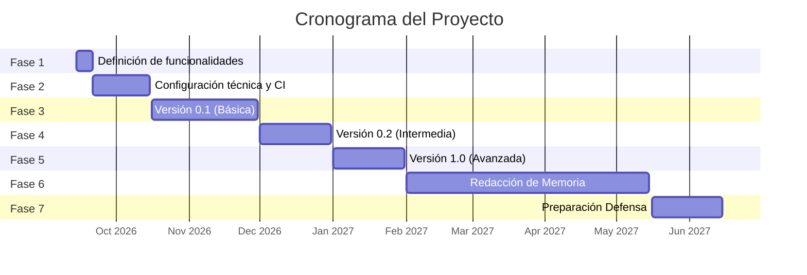

# Metodología
## Fases

El desarrollo del proyecto se realiza siguiendo una metodología iterativa e incremental estructurada en las siguientes etapas:  
- Fase 1: Definición de funcionalidades: Se indican las secciones concretas en las que se describe la funcionalidad general y detallada de la aplicación.  
- Fase 2: Configuración técnica: Configuración de las tecnologías y herramientas de desarrollo junto con controles de calidad periódicos.  
- Fases 3, 4 y 5: Desarrollo iterativo e incremental: Implementación de la aplicación en varios ciclos, publicando una versión (release) al término de cada fase.  
- Fase 6: Escritura de la memoria: Elaboración de la memoria escrita del TFG.  
- Fase 7: Preparación de la presentación: Preparación del material y contenido para el acto de defensa. 

Las fechas de inicio fin son provisionales y se acordarán con el tutor, con el objetivo de que en enero haya un cierre funcional de BetSphere para continuar con el segundo TFG.

| Fase | Inicio propuesto | Fin propuesto |
| :--- | :---: | :---: |
| **Fase 1** | 14/09/2026 | 21/09/2026 |
| **Fase 2** | 21/09/2026 | 15/10/2026 |
| **Fase 3** | 16/10/2026 | 30/11/2026 |
| **Fase 4** | 01/12/2026 | 31/12/2026 |
| **Fase 5** | 01/01/2027 | 31/01/2027 |
| **Fase 6** | 01/02/2027 | 15/05/2027 |
| **Fase 7** | 16/05/2027 | 15/06/2027 |

## Diagrama de Gantt

